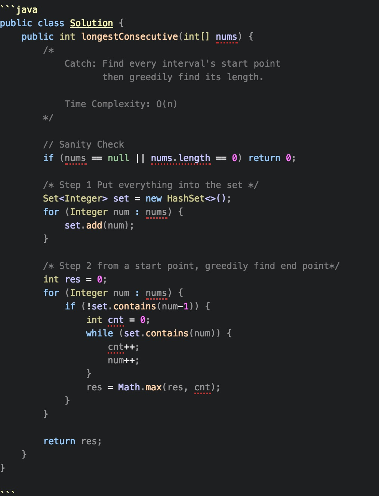
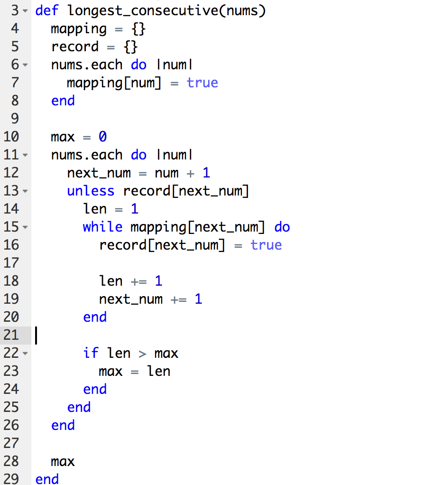
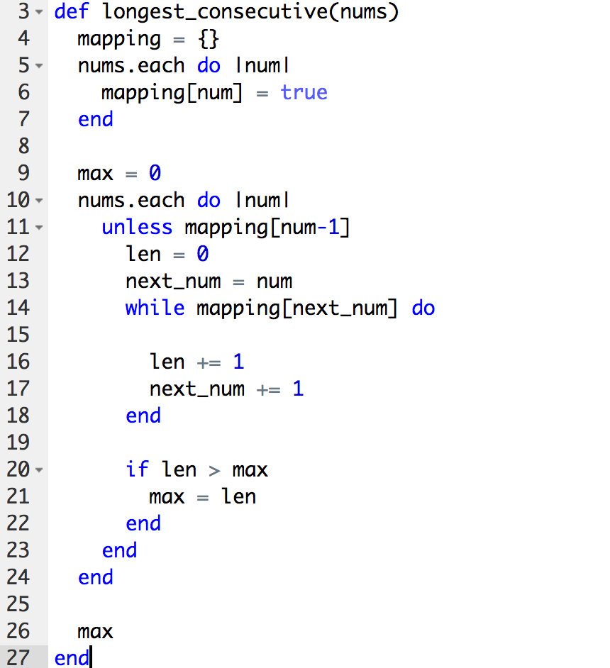
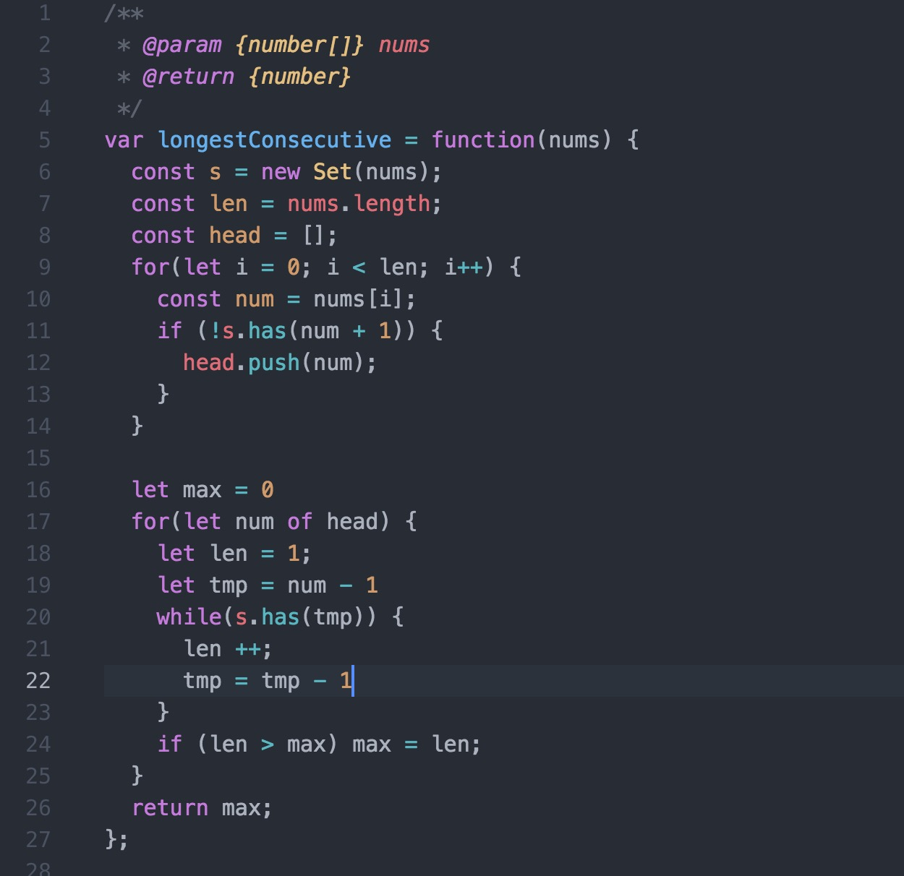
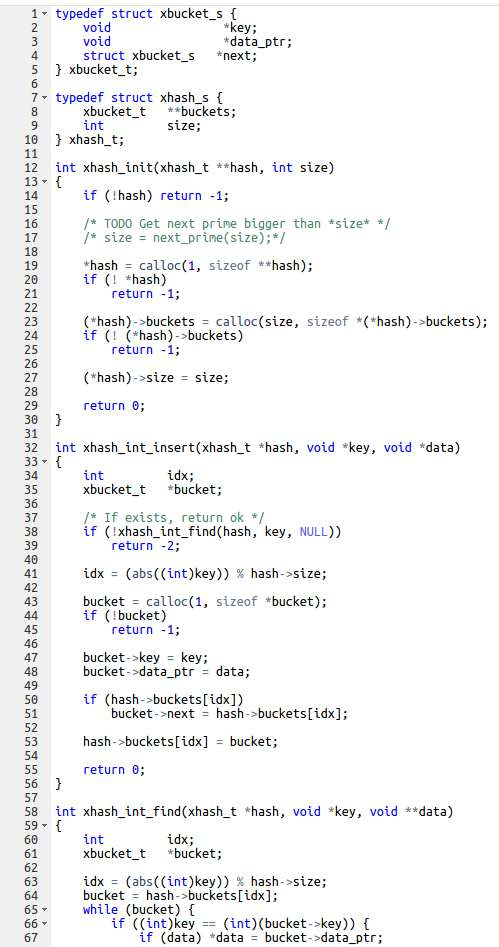
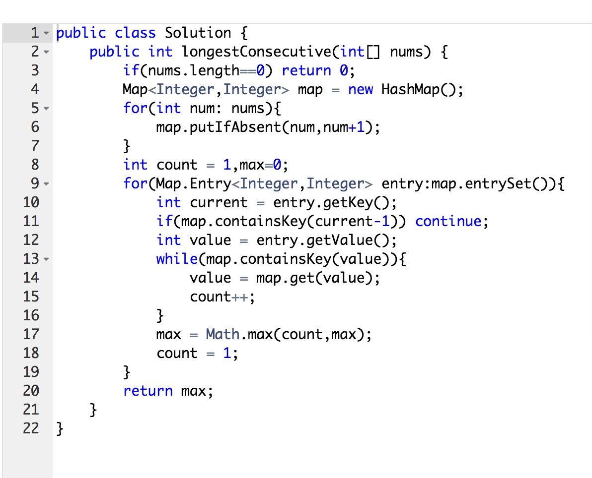
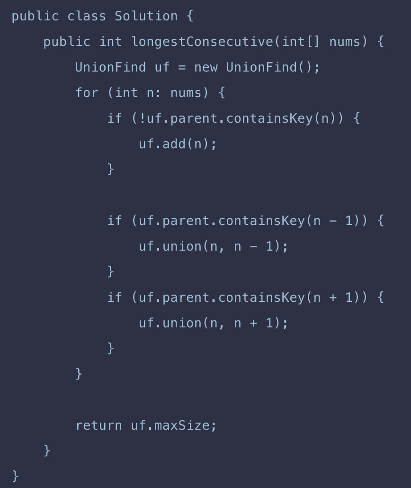
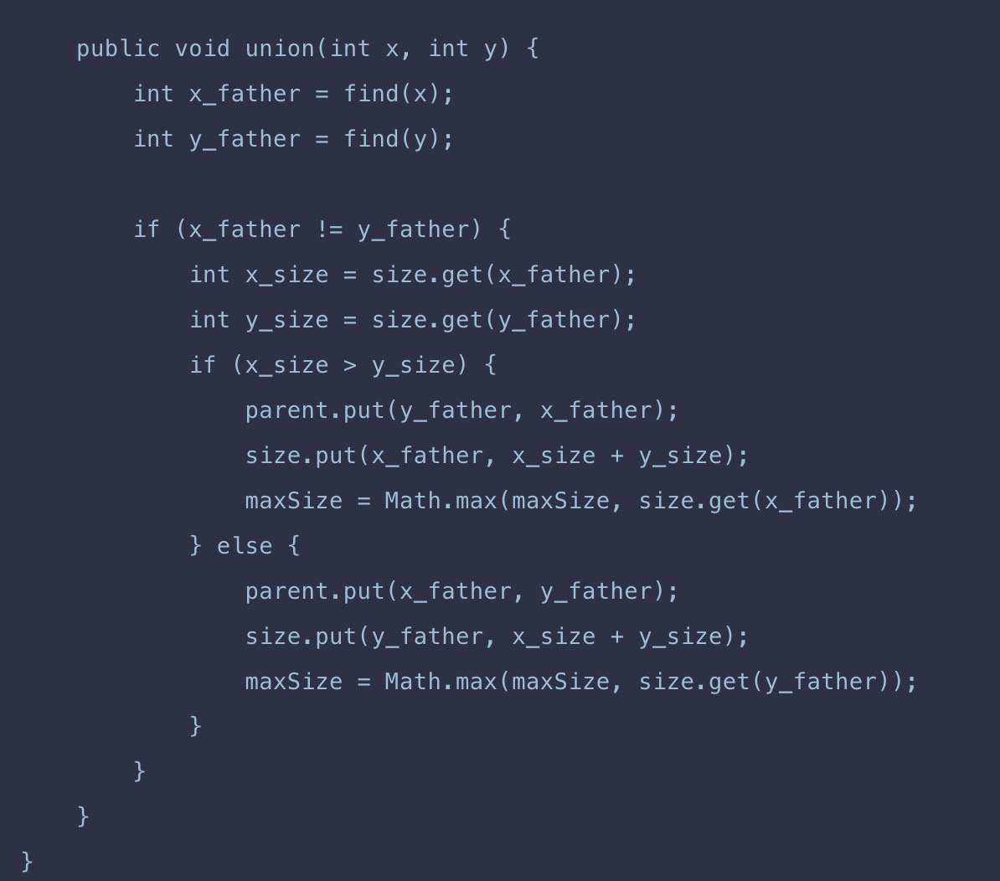

### 题目
Leetcode 第128题: Longest Consecutive Sequence

#### 描述
> Given an unsorted array of integers, find the length of the longest consecutive elements sequence.
>
> For example,
> Given [100, 4, 200, 1, 3, 2],
> The longest consecutive elements sequence is [1, 2, 3, 4]. Return its length: 4.
>
> Your algorithm should run in O(n) complexity.

#### 解释
输入一个数组，求该数组中的最大连续序列，不要求保持前后次序。

### 解法概要
- 散列表
- 并查集

### 思路解析

#### 散列表
散列表又叫 哈希表(Hash), 是根据关键码(key) 来查找值(value)的数据结构，查询的复杂度是O(1)。
在处理数组的问题中，我们通常需要通过散列表来提升算法的性能。数组也可以当做特殊意义的散列表，它的key是下标，value是数组元素的值。

> 本题的数组有一个特点：允许修改原数组。所以，最直接的方法是先对数组排序。因为一个有序的数组比一个无序的数组要容易处理很多。排序完以后，就可以通过遍历数组得到答案。
> 其思路的时间复杂度是 O(N*logN) + O(N) ~= O(N*logN)。时间复杂度上不符合要求。所以，接下来我们应该想办法降低时间复杂度。
> 降低时间复杂度的方法有哪些？散列表是一个很好的方案。在遍历数组的时候，假设我们遍历到了元素3, 这个时候，我们需要判断 2 和 4 是否在数组中。有什么O(1) 的算法可以做到呢？
> 很显然，散列表可以做到。如果我们提前将数组的数据存入散列表中。那么在遍历数组的时候，只需要O(1)的时间就能取到数据。

根据上面的分析，我们可以得到如下的算法思路:
1. 将数组的所有数据存入散列表中
2. 遍历数组，如果当前值 value + 1 的值在数组中，那么count加1

2 方法中有一个技巧，就是如何不重复的访问数据。假设我们已经访问了 1， 得到当前最长的连续序列的值是 4。那么2，3，4就没有必要访问了。处理这种情况的一般方法是存下访问的路径，当再次访问的时候，就直接返回，不在运行后续的代码。但是，这需要额外的存储空间。本题的技巧是，我们只需要判断起点就行了。

> 如何判断起点?
> 假设当前的值是 1, 那么我们只需要判断 0 是否在 Hash 中。如果不在Hash中，说明1是起点。
> 假设当前的值是 2，那么我们只需要判断 1 是否在 Hash 中。1 在Hash中，说明2不是起点。

#### 并查集
并查集是一种树型结构，用于处理一些不相交集合的合并和查询。如下是并查集的定义

> 在一些有N个元素的集合应用问题中，我们通常是在开始时让每个元素构成一个单元素的集合，
> 然后按一定顺序将属于同一组的元素所在的集合合并，其间要反复查找一个元素在哪个集合中。
> 这一类问题近几年来反复出现在信息学的国际国内赛题中，其特点是看似并不复杂，但数据量极大，
> 若用正常的数据结构来描述的话，往往在空间上过大，计算机无法承受；
> 即使在空间上勉强通过，运行的时间复杂度也极高，根本就不可能在比赛规定的运行时间（1～3秒）内计算出试题需要的结果，只能用并查集来描述。

并查集的关键是将同类型的元素放到同一个集合中。特别适合本题: 将相连的数字放在一个group里面，最后看有几个group，求出长度最大的group就行。

### 解法详细

#### 散列表的解法

@AKUK 的 Java 版本

@东东 提交的 Ruby 版本: 第一版本

@东东 提交的 Ruby 版本: 第二版本

@振平 的 python 版本

@王嘿嘿 的 JavaScript 版本

@当冬夜渐暖 的 Java 版本

@D@vid 的 Ruby 版本

@Cifer 的 C 版本
> 表示看不懂啊 ~

@王凯 的 python 版本

@Jerrold_Gao 的 Java 版本

#### 并查集的解法

@fzy 的 Java 版本

@许大方 的python 版本

